# 用户中心项目

## 企业做项目流程

需求分析 -》设计(简要设计，概要设计等) -》技术选型 -》初始化/引入需要的技术 -》写demo测试环境 -》编写代码（实现业务逻辑） -》单元测试 -》代码提交/代码评审 -》部署 -》上线


# 开发流程(后端为主)

* 前端初始化
* 后端初始化
  * 手动导入mybatis plus依赖 并测试
* 数据库设计(整个数据库就一张表)
  * 设置用户表
* 后端自动代码生成器
* 实现注册业务
* 实现登录业务


## 环境

* nodejs 14+ 
  换源 

  ```node
  阿里
  npm config set registry http://registry.npmmirror.com
  ```

  


# 前端

[Ant Design Pro][https://pro.ant.design/zh-CN/]

初始化  yarn(包管理器 可以并行下载依赖)
```cmd
npm install yarn tyarn -g
```

UI代码生成
```
yarn add @umijs/preset-ui -D
```


# 错误信息

启动时错误
```tex
yarn : 无法加载文件 C:\Users\Just Lee\AppData\Roaming\npm\yarn.ps1，因为在此系统上禁止运行脚本

npm : 无法加载文件 D:\NodeJS\npm.ps1，因为在此系统上禁止运行脚本。
```

解决方法：(PowerShell 安全策略问题)
```tex
第一步 查看权限
get-ExecutionPolicy

第二步 修改权限
set-executionpolicy remotesigned
```


# 后端

springboot项目初始化 服务器URL 

* 可选springboot 2.x.x- 3.0.2 版本  阿里https://start.aliyun.com
* springboot3 版本 官方https://start.spring.io/

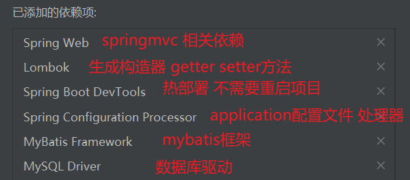


## 依赖(手动添加)

```xml
<!-- mybatis-plus 官网 https://baomidou.com/getting-started/ -->
<dependency>
    <groupId>com.baomidou</groupId>
    <artifactId>mybatis-plus-boot-starter</artifactId>
    <version>3.5.12</version>
</dependency>
```


## 注册逻辑

* 前端发送用户账户、密码、二次密码以及校验码(如手机号)	请求给后端
* 后端验证数据是否满足要求 sevice层
  * 账户长度 不小于 4位
  * 账户不包含特殊字符
  * 密码格式 不小于6位
  * 请求sql 验证账户是否已经存在
  * 两次密码是否匹配 及 校验码正确(todo)
* 对密码进行加密并存入数据库中 加盐(搅屎棍)


## 登录逻辑 

* 后端验证数据是否满足要求 service层
  * 账户长度 不小于 4位
  * 账户中不存在特殊字符
  * 密码格式 不小于6位
  * 查询用户是否存在 （账户、密码）
  * 数据脱敏
* 登录成功返回脱敏后的值  并 设置登录态 可以将key设置为 一个常量


接口测试


## 查询和删除逻辑

查询 和 删除 仅对**管理员生效** 数据库表中添加userRole字段 

* 调用 /search 接口 
  * 请求方式 Get
  * 所需参数 
    * String username 通过用户名进行模糊查询
    * HttpServletRequest用来获取session 判断登录态中的用户是否为管理员身份
  * 返回参数 JSON
* /delete 
  * 请求方式 Post
  * 所需参数 
    * long id 根据用的id进行删除 
    * HttpServletRequest用来获取session 判断登录态中的用户是否为管理员身份
  * 返回参数 JSON


# 数据库设计

用户表

createTime，updateTime，isDelete

> ​	企业中一般对于删除记录很敏感、一般通过一个特殊字段来进行标识 如上面的isDelete跟业务没有关系 只是用来标识这条数据的状态已经被删除了


id 用户id bigint

username 用户名 varchar

userAccount 用户账号 varchar

userPassword 用户密码 varchar

gender 用户性别

avatarUrl 用户头像 varchar

phone 用户电话 varchar

status 用户状态 tinyint

email 用户邮箱 varchar


createTime 用户创建时间

updateTime 用户修改时间

isDelete 删除用户 标识


## 数据库表

```mysql
create table user
(
    id           bigint auto_increment comment '用户id'
        primary key,
    username     varchar(512)                       null comment '用户名',
    userAccount  varchar(256)                       null comment '用户账号',
    userPassword varchar(256)                       not null comment '用户密码',
    gender       bigint                             null comment '性别',
    avatarUrl    varchar(1024)                      null comment '头像',
    phone        varchar(256)                       null comment '电话',
    status       int      default 0                 not null comment '用户状态 0 正常账户',
    email        varchar(256)                       null comment '用户邮箱',
    createTime   datetime default CURRENT_TIMESTAMP not null comment '用户创建时间',
    updateTime   datetime default CURRENT_TIMESTAMP not null on update CURRENT_TIMESTAMP comment '用户更新时间',
    isDelete     tinyint  default 0                 not null comment '标识该用户是否被删除 0 未删除'
);


```


## 错误信息

### 数据库异常错误

[42000][1064] You have an error in your SQL syntax; check the manual that corresponds to your MySQL server version for the right syntax to use near 'CURRENT_TIME not null comment '用户创建时间',
updateTime datetime de' at line 13.

```mysql
createTime   datetime default CURRENT_TIMESTAMP not null comment '用户创建时间',
updateTime   datetime default CURRENT_TIMESTAMP not null comment '用户更新时间',
```

> `CURRENT_TIME` 返回的是 **时:分:秒**，没有日期，不能直接作为 `datetime` 的默认值。
>
> `datetime` 或 `timestamp` 字段要用的是 **`CURRENT_TIMESTAMP`**。


### springboot中mybatisplus异常

Cause: java.sql.SQLSyntaxErrorException: Unknown column 'user_account' in 'field list'

```java
----数据库表字段---------
id
username
userAccount
userPassword
gender
avatarUrl
phone
status
email
createTime
updateTime
isDelete
------JavaBean 对象---------
private Long id;
private String username;
private String userAccount;
private String userPassword;
private Long gender;
private String avatarUrl;
private String phone;
private Integer status;
private String email;
private Date createTime;
private Date updateTime;
private Integer isDelete;
```


> 数据库字段设置的是驼峰命名 不是 下划线
>
> mybatisplus默认开启 驼峰匹配(mapUnderscoreToCamelCase) 既 表字段A_Column对应 Bean对象 aColumn
> 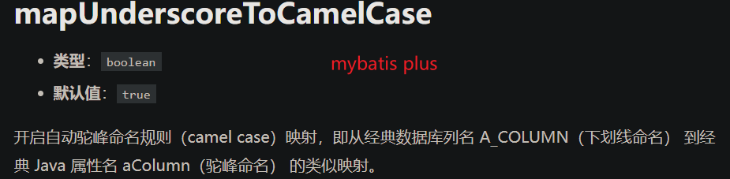
>
> mybatis 默认关闭
> 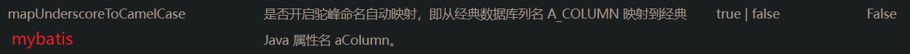


# 开发技巧

1. 搜索技巧：浏览器筛选 尽量选择1年以内的
2. 数据库中尽量不要用关键字作为字段 添加反引号 `  也不要用 避免后续风险
3. 存储密码一定不要明文存入的数据库中
4. 请求参数很长时不建议使用Get请求
5. prsf 快速输入 private static final 
6. 修改字段前 最好先搜一下哪些代码中用到了  防止修改过后 忘记修改使用先前字段的代码


# 插件

## 创建Bean对象通过插件

**根据mysql表自动生成相关 类、Service层(Service接口、实现类)、Mapper接口及配置文件xml)**

安装mybatisx
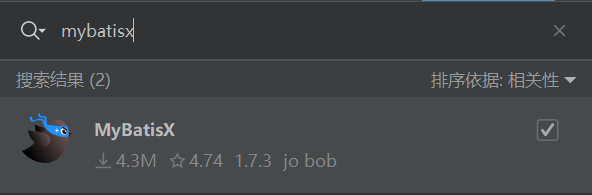

使用方式  右键表名
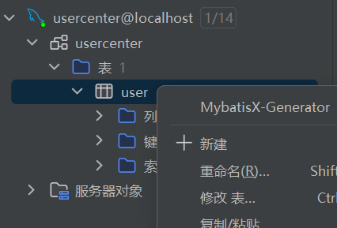

选择相关路径（小技巧：可以先放在项目包之外的包下 需要哪个类或xml配置文件再拖到项目里去  避免一些不必要的冲突）

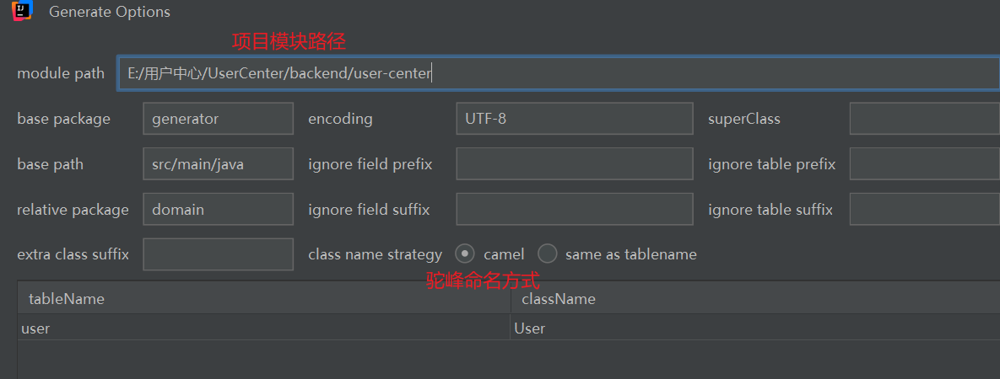


选择需要的属性

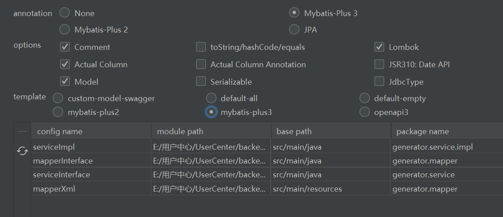

生成成功之后
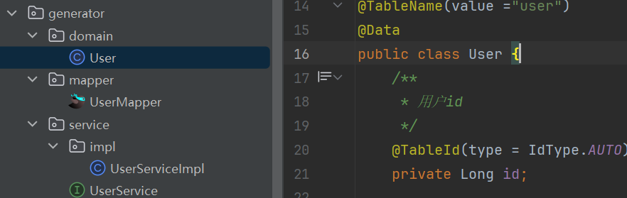

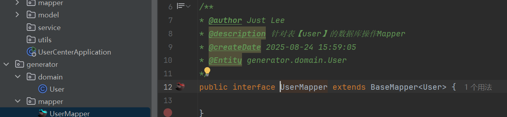

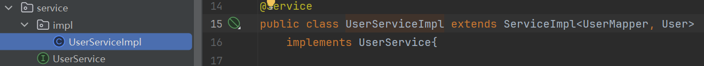

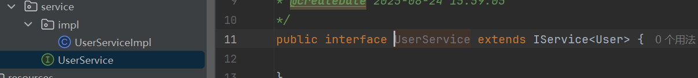

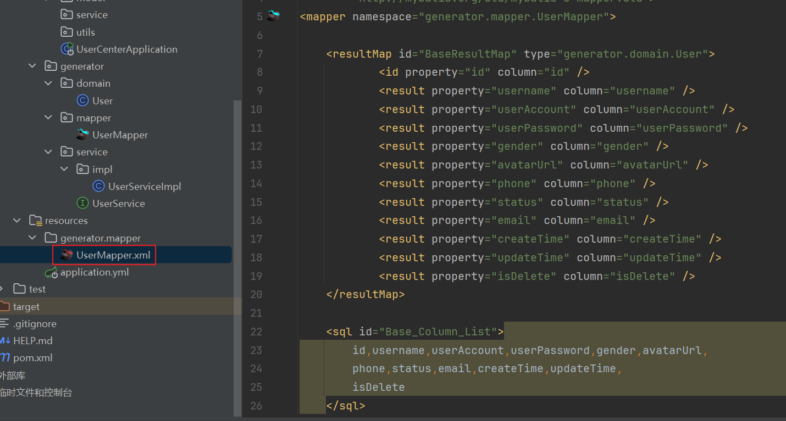


## 快速生成getter、setter方法插件

alter+enter 触发


## 快速填充参数插件

alter+enter触发

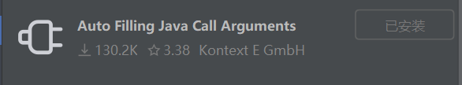


# 开发中所学知识点

## 数据库相关

1. create schema  database 区别是啥

   mysql中 schema 等同于 database

   oracle中 一个用户对应一个schema 可以通过schema.表名来获取数据

2. Apache工具类 

   ```java
   //判断css中是否有空值 或 null
   StringUtils.isAnyBlank(CharSequence... css)     
   ```

3. 单元测试断言(junit 5)
   ```java
   Assertion.assertEquals(预期值,实际值)	//没有返回值 如果实际值与预期值不匹配 报错
   ```

   