# 先完成再完美

# 用户中心项目

## 企业做项目流程

需求分析 -》设计(简要设计，概要设计等) -》技术选型 -》初始化/引入需要的技术 -》写demo测试环境 -》编写代码（实现业务逻辑） -》单元测试 -》代码提交/代码评审 -》部署 -》上线


# 开发流程(后端为主)

* 前端初始化
* 后端初始化
  * 手动导入mybatis plus依赖 并测试
* 数据库设计(整个数据库就一张表)
  * 设置用户表
* 后端自动代码生成器 插件mybatisx
* 实现注册业务
* 实现登录业务
* 实现登出业务


## 环境

* nodejs 14+ 
  换源 

  ```node
  阿里
  npm config set registry http://registry.npmmirror.com
  ```

  

# 多环境

[参考文档][https://blog.csdn.net/weixin_41701290/article/details/120173283?ops_request_misc=%257B%2522request%255Fid%2522%253A%2522a6097e1780fe92ba592094074af19b3d%2522%252C%2522scm%2522%253A%252220140713.130102334.pc%255Fblog.%2522%257D&request_id=a6097e1780fe92ba592094074af19b3d&biz_id=0&utm_medium=distribute.pc_search_result.none-task-blog-2~blog~first_rank_ecpm_v1~rank_v31_ecpm-1-120173283-null-null.nonecase&utm_term=%E5%A4%9A%E7%8E%AF%E5%A2%83&spm=1018.2226.3001.4450]

本地开发：localhost

多环境：指同一套项目在不同的阶段需要根据实际情况调整配置并部署在不同的机器上

为什么需要？

1. 每个环境之间互不影响
2. 区分不同的阶段：开发/测试/生产
3. 对项目进行优化：
   1. 本地日志级别 (防止给用户暴露过多的信息)
   2. 精简依赖，节省项目体积
   3. 项目的环境/参数可以调整 如JVM参数 🌀

针对不同的环境做不同的事情


多环境分类：

1. 本地环境：(自己的电脑) localhost
2. 开发环境：(远程开发)大家连同一台机器，为了大家开发方便
3. 测试环境：(测试)开发/测试/产品，单元测试/性能测试/功能测试/系统集成测试(测试一系列功能测试) 独立的数据库、独立的服务器
   1. 沙箱环境（实验环境）大公司才会有
4. 预发布环境（体验服）：和正式环境一致，同一个数据库
5. 正式环境(线上，公开对外访问的项目)：尽量不要改动，保证上线"完美"运行


项目打包完成后运行命令

```bash
java -jar 包名 --spring.profiles.active = 配置文件名
```

主要是改

* 依赖的环境地址
  * 数据库地址
  * 缓存地址
  * 消息队列地址
  * 项目端口号
* 服务器配置


# 项目部署

[参考文档][https://www.bilibili.com/opus/650021069734805524]

需要Linux服务器(尽量使用Centos8+)


## 原始部署

所谓原始部署就是什么都自己装


### 配置步骤

前端 nginx部署

安装nginx服务器 一定要学会

1. 用系统自带的软件包管理器快速安装 如centos的yum,ubuntu的apt

2. 去官网下载 https://nginx.org/en/download.html
   ```bash
   netstat -ntlp 查看当前端口被哪个进程占用
   nohup  &
   jobs 使用nohup运行的程序
   jps 查看当前运行的Java程序
   ```


后端部署 

安装jdk、maven打包工具 运行jar包即可


## 宝塔Linux


## Docker部署

docker是容器，可以将项目环境（如java、nginx）和项目的代码一起打包成镜像，更容易分发和移植。

在启动项目时，不需要敲一大堆命令，而是直接下载镜像启动即可


# 前端

[Ant Design Pro][https://pro.ant.design/zh-CN/]

初始化  yarn(包管理器 可以并行下载依赖)
```cmd
npm install yarn tyarn -g
```

UI代码生成
```
yarn add @umijs/preset-ui -D
```


# 错误信息

启动时错误
```tex
yarn : 无法加载文件 C:\Users\Just Lee\AppData\Roaming\npm\yarn.ps1，因为在此系统上禁止运行脚本

npm : 无法加载文件 D:\NodeJS\npm.ps1，因为在此系统上禁止运行脚本。
```

解决方法：(PowerShell 安全策略问题)
```tex
第一步 查看权限
get-ExecutionPolicy

第二步 修改权限
set-executionpolicy remotesigned
```


# 后端

springboot项目初始化 服务器URL 

* 可选springboot 2.x.x- 3.0.2 版本  阿里https://start.aliyun.com
* springboot3 版本 官方https://start.spring.io/


## 依赖(手动添加)

```xml
<!-- mybatis-plus 官网 https://baomidou.com/getting-started/ -->
<dependency>
    <groupId>com.baomidou</groupId>
    <artifactId>mybatis-plus-boot-starter</artifactId>
    <version>3.5.12</version>
</dependency>
```


## 注册逻辑

* 前端发送用户账户、密码、二次密码以及校验码(如手机号)	请求给后端
* 后端验证数据是否满足要求 sevice层
  * 账户长度 不小于 4位
  * 账户不包含特殊字符
  * 密码格式 不小于8位
  * 请求sql 验证账户是否已经存在
  * 两次密码是否匹配 及 校验码正确(todo)
* 对密码进行加密并存入数据库中 加盐(搅屎棍)

```java
 //用户名不能包含特殊字符
String validPattern = "[`~!@#$%^&*()+=|{}':;',\\\\[\\\\].<>/?~！@#￥%……&*（）——+|{}【】‘；：”“’。，、？]";
Matcher matcher = Pattern.compile(validPattern).matcher(userAccount);
if (matcher.find()) {
    throw new BusinessException(ErrorCode.PARAM_ERROR,"用户名包含特殊字符");

}
```


## 登录逻辑 

* 后端验证数据是否满足要求 service层
  * 账户长度 不小于 4位
  * 账户中不存在特殊字符
  * 密码格式 不小于8位
  * 查询用户是否存在 （账户、密码）（mp逻辑删除 防止isDelete为1的用户被找到）
  * 数据脱敏
* 登录成功返回脱敏后的值  并 设置登录态 可以将key设置为 一个常量


## 接口测试

```java
@RestController
@RequestMapping(("/user"))
public class UserController {
    @Resource
    private UserService userService;

    @PostMapping("/login")
    public User userLogin(@RequestBody UserLoginRequest userLoginRequest, HttpServletRequest request) {
        if (userLoginRequest == null) {
            return null;
        }
        String userAccount = userLoginRequest.getUserAccount();

        String userPassword = userLoginRequest.getUserPassword();


        if (StringUtils.isAnyBlank(userAccount, userPassword)) {
            return null;
        }

        return userService.userLogin(userAccount, userPassword, request);
    }

    @PostMapping("/register")
    public Long userRegister(@RequestBody UserRegisterRequest userRegisterRequest) {
        if (userRegisterRequest == null) {
            return null;
        }
        String userAccount = userRegisterRequest.getUserAccount();
        String userPassword = userRegisterRequest.getUserPassword();
        String checkPassword = userRegisterRequest.getCheckPassword();


        if (StringUtils.isAnyBlank(userAccount, userPassword, checkPassword)) {
            return null;
        }

        return userService.userRegister(userAccount, userPassword, checkPassword);
    }


}
```


### IDEA自带工具

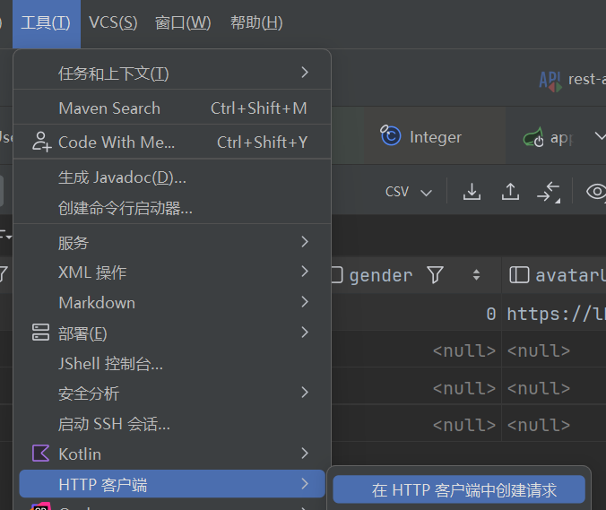

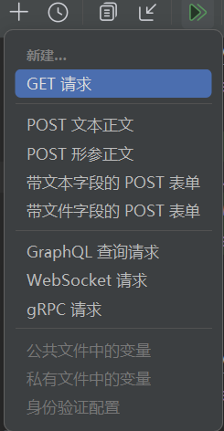

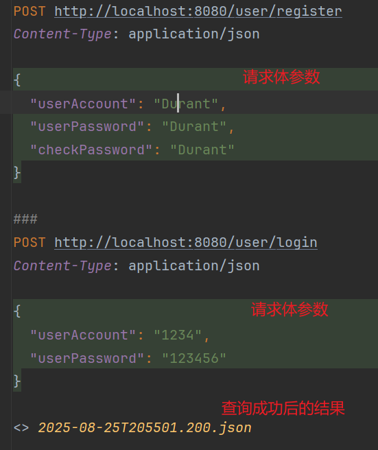


## 用户管理接口

`查询、删除`

### 查询和删除逻辑

查询 和 删除 仅对**管理员生效** 数据库表中添加userRole字段  **鉴权**

* 调用 /search 接口 
  * 请求方式 Get
  * 所需参数 
    * String username 通过用户名进行模糊查询
    * HttpServletRequest用来获取session 判断登录态中的用户是否为管理员身份
  * 返回参数 JSON
* /delete 
  * 请求方式 Post
  * 所需参数 
    * long id 根据用户的id进行删除 
    * HttpServletRequest用来获取session 判断登录态中的用户是否为管理员身份
  * 返回参数 JSON


## 用户登出

请求方式：POST

请求地址：/logout

请求方法返回值：return 1;


## 用户注册校验 对注册业务做小小的升级

> 简易版 用户手动输入 星球编号  复杂项目不推荐使用

重新修改表结构、改动代码

请求方式：Post

请求地址：/register

修改注册业务

* 修改数据表结构 添加 planetCode字段 varchar 非空 默认值为0

* 添加星球编号参数   参数过多可以封装成一个类对象 这里我就不封装了
* 验证星球编号的长度是否 不为空 、不会null 且 长度不大于5 
* 查询数据库表该编号是否存在 


> 注册 个人扩展 to do 注册手机号、通过手机号进行登录


## 后端优化

1. **返回通用对象**

   对请求响应的结果进行封装、补充一些信息 告诉前端在业务层面上是成功还是失败

   ```json
   {
       "date":"xxxx"
   }
   
   |
   V
   
   请求成功
   {
       "code": 状态码    为什么不用Http的状态码  404、500、400、405 等 主要是这样的状态码太过于广泛不能很精确的知道程序那里的问题 如500内部异常是哪个请求的哪个方法出现了问题呢 对此我们使用自定义的状态码 更好的定位错误
       "data":{"username":"xxxxx"....}
   	"message":"ok"
   }
   
   |
   V
   
   请求错误
   {
       "code":状态码,
       "data":{空},
   	"message":"报错的信息",
       "description":"更详细的报错信息"
   }
   ```

   ```java
   com/jakie/usercenter/common包下
   @Data
   public class BaseResponse<T> implements Serializable {
       private int code;
       private T data;
       private String msg;
       private String description;
   
       public BaseResponse(int code, T data, String msg) {
           this.code = code;
           this.data = data;
           this.msg = msg;
           
       }
   }
   
   Controller层返回的对象
       new BaseResponse<>(200,data,"xxx");
   
   Live template设置热键 可快速生成代码
       
   还可以写一个类对上面的再次进行封装 对一些固定的值(状态码、msg)不需要手动编写 防止写错
   /**
    * 返回结果处理类
    */
   public class ResultUtils {
       public static <T> BaseResponse<T> success(T data) {
           return new BaseResponse<>(200,data,"请求成功");
       }
   }
   通过这个工具类只需要将结果传入对应的方法返回值 即可防止错误的发生
       
       优化Controller层返回的对象
   return ResultUtils.success(方法返回值)
   ```

   1. 封装状态码及状态码的含义
      ```java
      public enum ErrorCode {
      
          SUCCESS(20000,"请求成功",""),
          PARAM_ERROR(40001,"参数异常",""),
          NOT_LOGIN(40002,"未登录",""),
          NO_AUTH(40003,"权限不足",""),
          NULL_PARAM(40004,"参数为空","");
      
          private final int code;
          private final String message;
          private final String description;
      
      
      
          ErrorCode(int code, String message, String description) {
              this.code = code;
              this.message = message;
              this.description = description;
          }
      ```

      优化返回结果处理类 添加ErrorCode为参数的error方法 再对应的BaseResponse类中添加相对的构造器
      ```java
      public class ResultUtils {
          public static <T> BaseResponse<T> success(T data) {
              return new BaseResponse<>(200,data,"请求成功");
          }
      
          public static BaseResponse error(ErrorCode errorCode) {
              return new BaseResponse<>(errorCode);
          }
      }
      ```

      优化Controller层返回的错误信息
      ```java
       @PostMapping("/login")
          public BaseResponse<User> userLogin(@RequestBody UserLoginRequest userLoginRequest, HttpServletRequest request) {
              if (userLoginRequest == null) {
                  return ResultUtils.error(ErrorCode.NULL_PARAM);
      //            return null;
              }
      ```

   2. 全局异常处理
      定义全局异常处理类 未受检异常(unchecked Exception) 调用者可以不用使用try-catch捕获异常 并且不需要throws 异常 JVM会自动帮我们抛出

   ```java
   package com.jakie.usercenter.exception;
   
   import com.jakie.usercenter.common.ErrorCode;
   
   public class BusinessException extends RuntimeException {
   
       private final int code;
       private final String message;
       private final String description;
   
       public BusinessException(String message, int code, String msg, String description) {
           super(message);
           this.code = code;
           this.message = message;
           this.description = description;
       }
   
       public BusinessException(ErrorCode errorCode, String description) {
           super(errorCode.getMessage());
           this.code = errorCode.getCode();
           this.message = errorCode.getMessage();
           this.description = description;
       }
   }
   
   ```

   测试注册 
   ```json
   Post http://localhost:8080/user/register
   {
       "userAccount":"jakie",
       "userPassword":"123456",
       "checkPassword":"123456",
       "planetCode":"1"
   }
   ```

   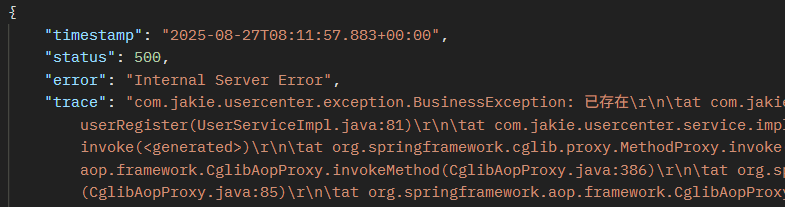

   为什么报500 是因为后端报错了
   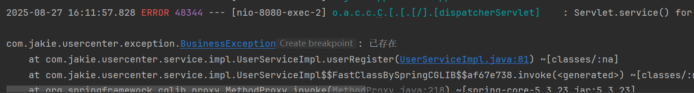

   显然这不符合我们最开始想要的`返回公共对象`结果
   ```java
   成功
   {
       "code":"",
       "data":{"xxx":"xxx"}
       "message":"xxx"
   }
   ```

   引出全局异常处理

   1. 编写全局异常处理器 (**可以在处理全局异常的地方 打印日志(对日志集中管理)**)
      @RestControllerAdvice + @ExceptionHandler

      作用：

      1. 捕获全局异常、集中处理，让前端获取跟详细的信息

      2. 同时屏蔽掉项目本身的异常（不暴露服务器内部状态）

         > 安全隐患  暴露了项目的结构
         >
         > 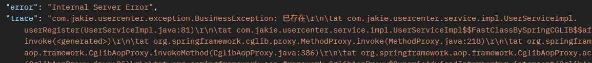


​				实现：通过Spring Aop 实现方法调用的前后的进行额外的处理


# 写代码流程

先做设计

编写代码

持续优化！！！ （提取公共代码、复用代码/常量）


# 数据库设计

用户表

createTime，updateTime，isDelete

> ​	企业中一般对于删除记录很敏感、一般通过一个特殊字段来进行标识 如上面的isDelete跟业务没有关系 只是用来标识这条数据的状态已经被删除了


id 用户id bigint

username 用户名 varchar

userAccount 用户账号 varchar

userPassword 用户密码 varchar

gender 用户性别

avatarUrl 用户头像 varchar

phone 用户电话 varchar

status 用户状态 tinyint

email 用户邮箱 varchar


createTime 用户创建时间

updateTime 用户修改时间

isDelete 删除用户 标识


## 数据库表

```mysql
create table user
(
    id           bigint auto_increment comment '用户id'
        primary key,
    username     varchar(512)                       null comment '用户名',
    userAccount  varchar(256)                       null comment '用户账号',
    userPassword varchar(256)                       not null comment '用户密码',
    gender       bigint                             null comment '性别',
    avatarUrl    varchar(1024)                      null comment '头像',
    phone        varchar(256)                       null comment '电话',
    status       int      default 0                 not null comment '用户状态 0 正常账户',
    email        varchar(256)                       null comment '用户邮箱',
    createTime   datetime default CURRENT_TIMESTAMP not null comment '用户创建时间',
    updateTime   datetime default CURRENT_TIMESTAMP not null on update CURRENT_TIMESTAMP comment '用户更新时间',
    isDelete     tinyint  default 0                 not null comment '标识该用户是否被删除 0 未删除'
);


```


## 错误信息

### 数据库异常错误

[42000][1064] You have an error in your SQL syntax; check the manual that corresponds to your MySQL server version for the right syntax to use near 'CURRENT_TIME not null comment '用户创建时间',
updateTime datetime de' at line 13.

```mysql
createTime   datetime default CURRENT_TIMESTAMP not null comment '用户创建时间',
updateTime   datetime default CURRENT_TIMESTAMP not null comment '用户更新时间',
```

> `CURRENT_TIME` 返回的是 **时:分:秒**，没有日期，不能直接作为 `datetime` 的默认值。
>
> `datetime` 或 `timestamp` 字段要用的是 **`CURRENT_TIMESTAMP`**。


### springboot中mybatisplus异常

Cause: java.sql.SQLSyntaxErrorException: Unknown column 'user_account' in 'field list'

```java
----数据库表字段---------
id
username
userAccount
userPassword
gender
avatarUrl
phone
status
email
createTime
updateTime
isDelete
------JavaBean 对象---------
private Long id;
private String username;
private String userAccount;
private String userPassword;
private Long gender;
private String avatarUrl;
private String phone;
private Integer status;
private String email;
private Date createTime;
private Date updateTime;
private Integer isDelete;
```


> 数据库字段名是驼峰命名 不是 下划线的情况
>
> mybatisplus默认开启 驼峰匹配(mapUnderscoreToCamelCase) 既 表字段A_Column对应 Bean对象 aColumn
> 
>
> mybatis 默认关闭
> 


# 开发技巧

1. 搜索技巧：浏览器筛选 尽量选择1年以内的
2. 数据库中尽量不要用关键字作为字段 添加反引号 `  也不要用 避免后续风险
3. 存储密码一定不要明文存入的数据库中
4. 请求参数很长时不建议使用Get请求
5. prsf 快速输入 private static final 
6. 修改字段前 最好先搜一下哪些代码中用到了  防止修改过后 忘记修改使用先前字段的代码
7. 如果业务逻辑简单且Controller层就能解决 可以直接交给Controller处理 **但尽量避免 越少越好**
8. 返回通用对象 封装状态码及状态码的含义
9. maven 打包过程 可以禁用测试
   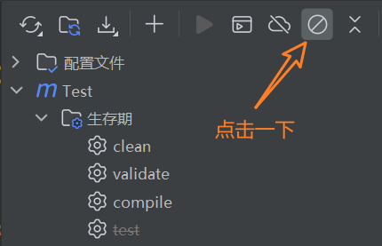


# 插件

## 创建Bean对象通过插件

**根据mysql表自动生成相关 类、Service层(Service接口、实现类)、Mapper接口及配置文件xml)**

安装mybatisx


使用方式  右键表名


选择相关路径（小技巧：可以先放在项目包之外的包下 需要哪个类或xml配置文件再拖到项目里去  避免一些不必要的冲突）


选择需要的属性


生成成功之后


## 快速生成getter、setter方法插件

alter+enter 触发


## 快速填充参数插件

alter+enter触发


# 开发中所学知识点

## 数据库相关

1. create schema  database 区别是啥

   mysql中 schema 等同于 database

   oracle中 一个用户对应一个schema 可以通过schema.表名来获取数据

## Apache工具类

1. Apache工具类 

   ```java
   //判断css中是否有空值 或 null
   StringUtils.isAnyBlank(CharSequence... css)     
   ```

## 单元测试

1. 单元测试断言(junit 5)
   ```java
   Assertion.assertEquals(预期值,实际值)	//没有返回值 如果实际值与预期值不匹配 报错
   ```


## 网络相关

1. 代理知识 

   为什么要进行代理 假设前后端分离项目 前端的端口为8000 后端的端口为8080 前端没办法直接访问 后端这个时候就需要用到代理 

   

   正向代理：替客户端发送请求 ()

   * 通过代理服务器
   * 前端项代理服务器发送请求
   * 代理服务器再将前端的请求发送给后端

   

   反向代理：替服务器接收请求 

   * 同样通过代理服务器 接受前端请求
   * 代理服务器通过某种算法将请求分摊给多台服务器 实现`负载均衡`

## Java基础

1. Java 枚举不支持setter方法


# 项目部署

服务器使用的是Ubuntu 22

## 本地启动

前端node版本 16.16.0

`nvm use node版本号`   切换版本

`nvm install node版本号` 下载相对应的版本

`npm run start:dev` 启动项目

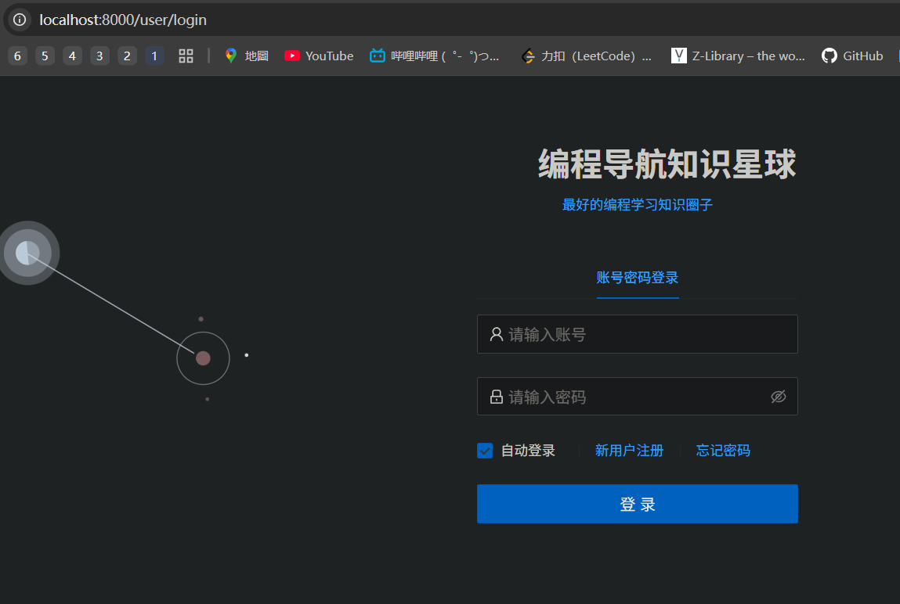


## ✅ 修改相关IP地址

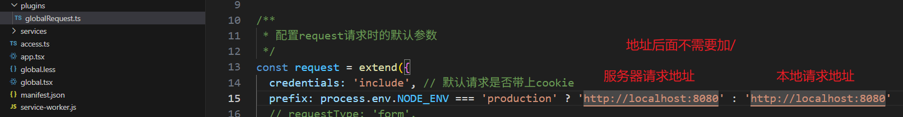


## todo 跨域问题 

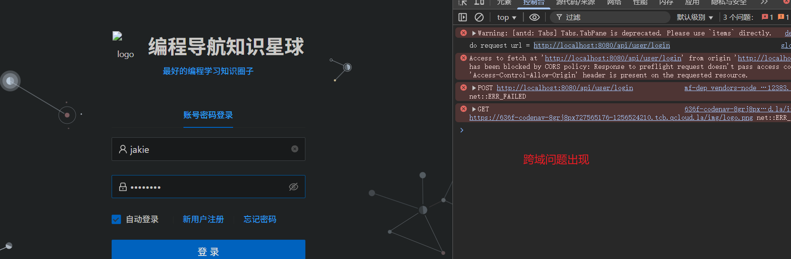


## 部署方式

**服务器使用的是Ubuntu 22**

### 原始部署

#### 前端

##### nginx安装

[nginx官网下载地址][https://nginx.org/en/download.html] 
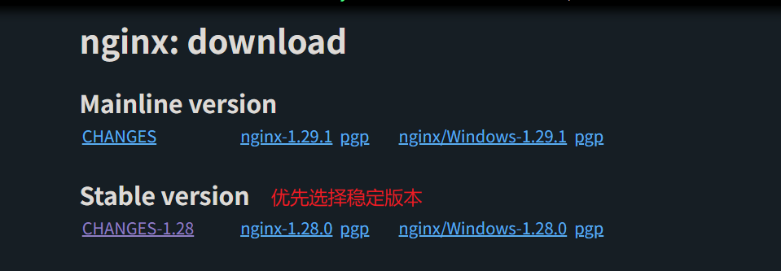

```java

//下载命令
curl -o nginx-1.21.6.tar.gz http://nginx.org/download/nginx-1.21.6.tar.gz

//下载成功之后 解压  v属性表示可视化解压过程
tar -zxvf nginx-1.21.6.tar.gz
    

//进入到 Nginx 解压目录
cd  nginx-1.21.6
//编译前的配置和依赖检查
./configure
    
//编译
make
//安装
make install
```


**Nginx安装完成后，默认自动创建 /usr/local/nginx 目录**

##### nginx配置

```bash
# 配置nginx环境变量
vim /etc/profile
    # /etc/profile文件尾添加
	export PATH=$PATH:/usr/local/nginx/sbin

# 添加完成后 esc + :wq 保存并退出
        
# nginx环境生效
source /etc/profile

# 启动nginx
nginx

# 查看nginx是否启动成功
netstat -ntlp

# 进入/service/nginx-1.21.6/conf 复制nginx.conf 并备份为nginx.default.conf
# 鱼皮建议不要动nginx.conf文件
cd /service/nginx-1.21.6/conf
cp nginx.conf nginx.default.conf
```

启动成功
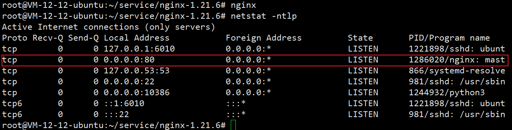


##### 前端打包

打包过后生成dist文件夹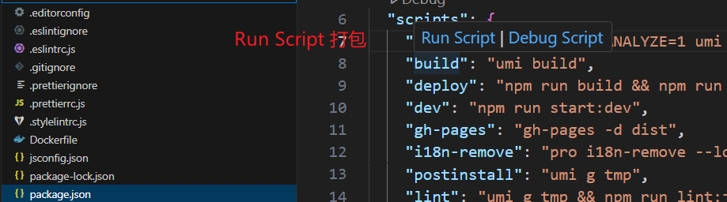


压缩文件夹

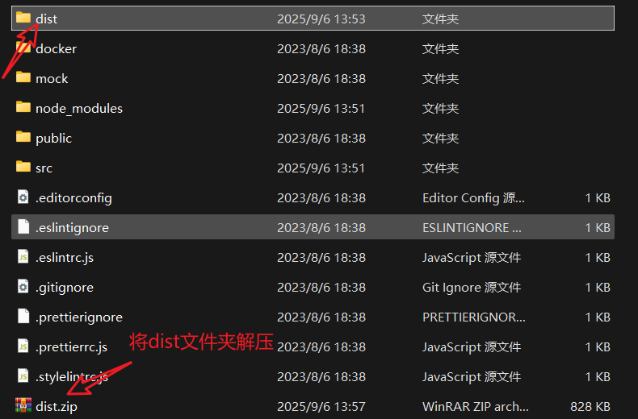

上传到服务器(放到跟nginx一个包下)

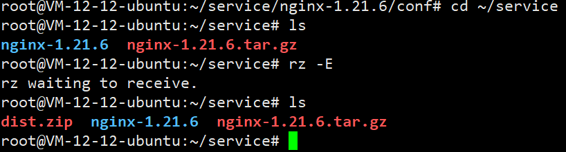

使用命令解压
```bash
# -d 指定解压后文件的存放目录
unzip dist.zip -d user-center-front	
```


把user-center-front/dist下的所有内容移到user-center-front中 并删除空文件夹dist
```bash
cd user-center-front/dist
mv * ../
rm -rf dist
```


现在前端的文件都放到服务器的/root/service/user-center-front文件夹中
我们需要对之前的nginx.conf配置文件进行修改

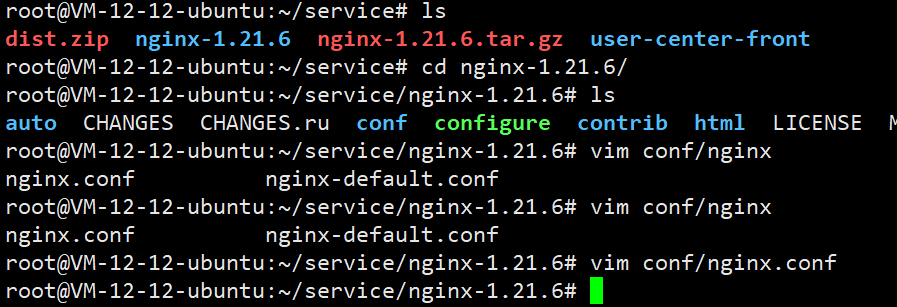

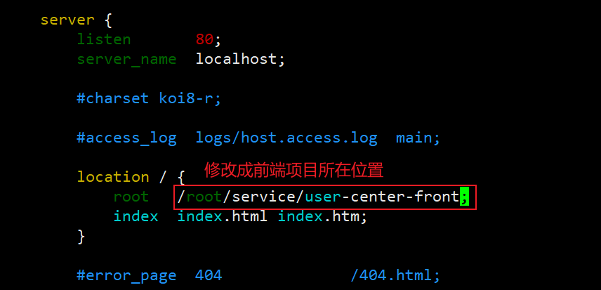

修改完成后:wq保存修改并退出
访问公网地址 http://81.68.217.102/user/login

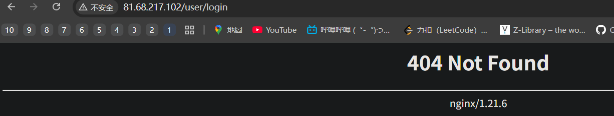

据鱼皮说是，因为之前Nginx的安装时，编译重置了安装环境，现在的Nginx的配置文件在最外面的  usr/local/nginx里我们把serveice文件里的nginx.conf复制到 usr/local/nginx /conf/
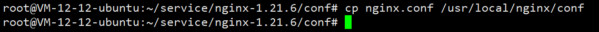


然后ngixn -s reload 发现还是报错

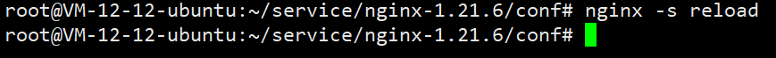

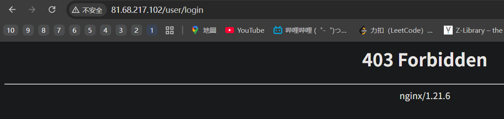

通过查看进程我们发现有一个	UID是 **nobody**
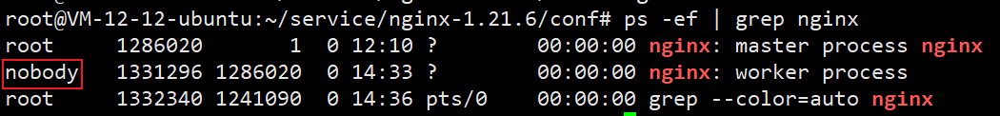


再次修改nginx.conf文件夹 (别忘了同时也要改/usr/local/nginx/conf/nginx.conf 或者直接复制)

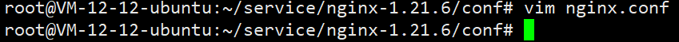

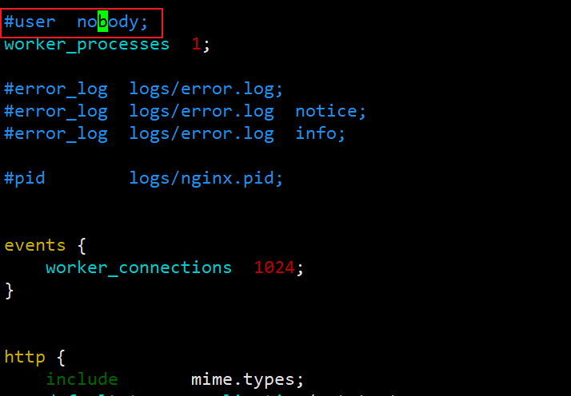

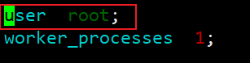

再次nginx -s reload 访问 http://81.68.217.102/user/login
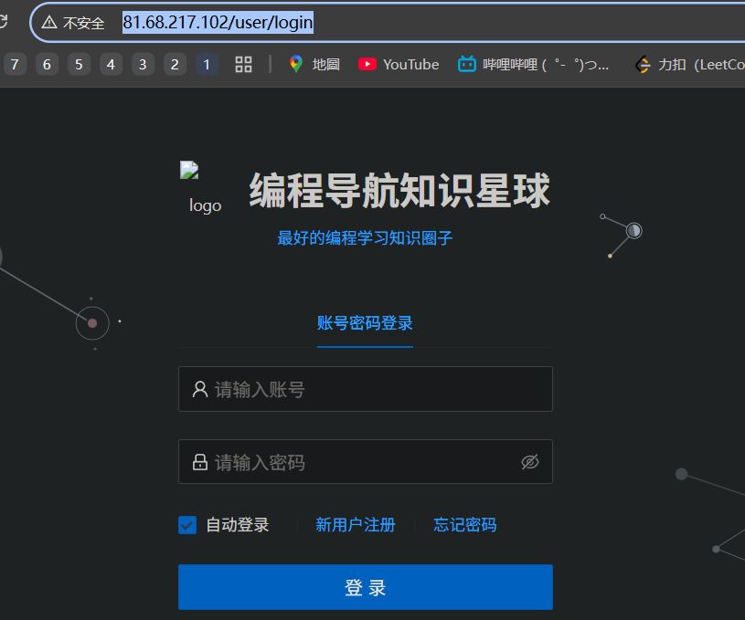


#### 后端

安装jdk maven

* jdk 1.8

* maven 3.9.10

  [maven官网][https://maven.apache.org/]

  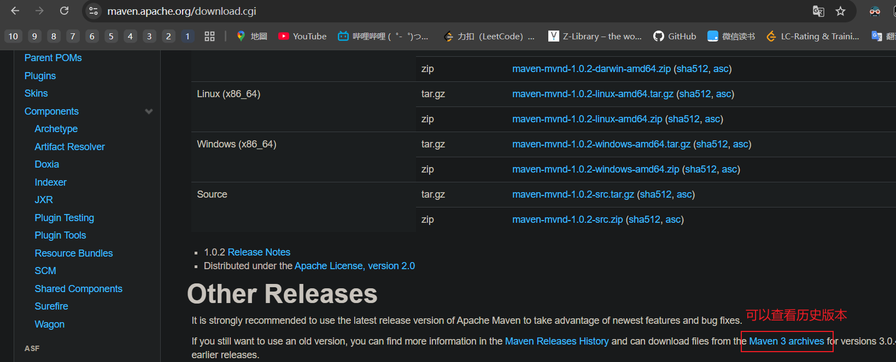

```bash
# -y 安装过程中所有的询问都输入 y 不需要手动输入
apt install -y openjdk-8-jdk
curl -o apache-maven-3.9.10-bin.tar.gz https://archive.apache.org/dist/maven/maven-3/3.9.10/binaries/apache-maven-3.9.10-bin.tar.gz
# 这里下载apache-maven-3.9.10-bin.tar.gz太慢 我直接下到本地然后再上传的服务器上
```

下载成功后 进行解压
```bash
tar -zxvf apache-maven-3.9.10-bin.tar.gz
```

配置maven环境变量

```bash
pwd 
/root/service/apache-maven-3.9.10/bin

vim /etc/profile
source /etc/profile
```

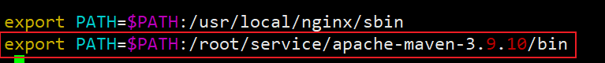

> 这有多种构建方式
>
> * 本地打包 然后上传到服务器上
> * 通过git拉去远程仓库后端代码
> * 使用maven进行打包 <- 下面演示这种

打包构建，跳过测试

```bash
mvn package -DskipTests
```


### 安装宝塔Linux

#### 连接服务器

```bash
if [ -f /usr/bin/curl ];then curl -sSO https://download.bt.cn/install/install_panel.sh;else wget -O install_panel.sh https://download.bt.cn/install/install_panel.sh;fi;bash install_panel.sh
```


# 项目部署上线流程

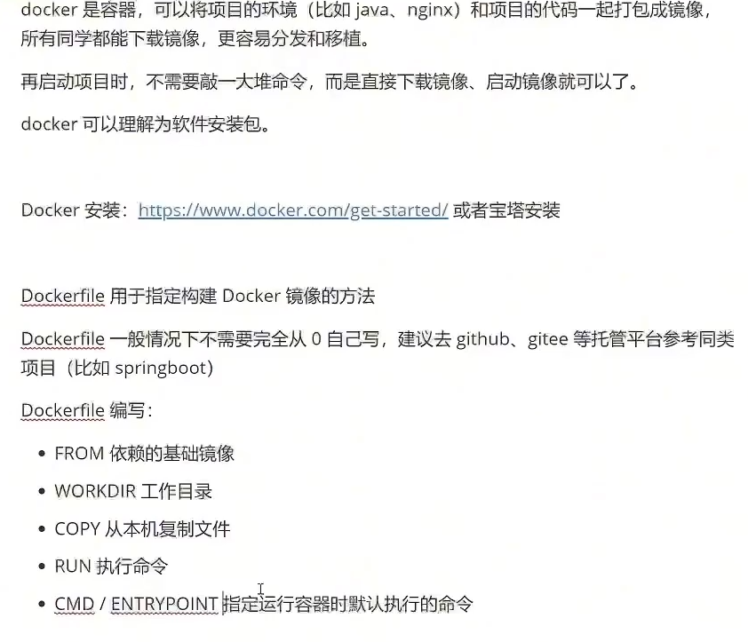

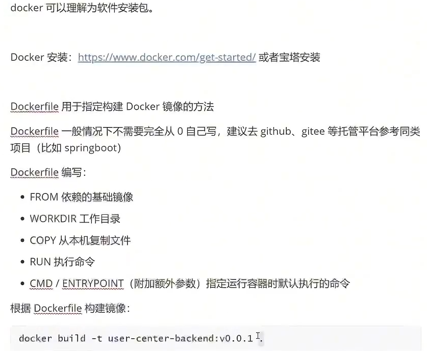

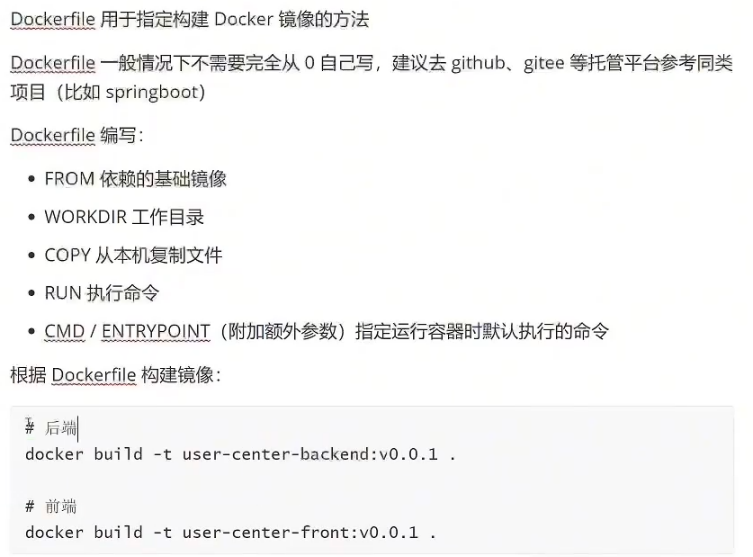

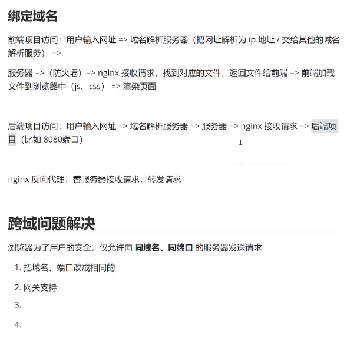