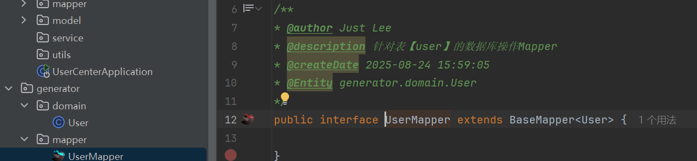

# 先完成再完美

# 用户中心项目

## 企业做项目流程

需求分析 -》设计(简要设计，概要设计等) -》技术选型 -》初始化/引入需要的技术 -》写demo测试环境 -》编写代码（实现业务逻辑） -》单元测试 -》代码提交/代码评审 -》部署 -》上线


# 开发流程(后端为主)

* 前端初始化
* 后端初始化
  * 手动导入mybatis plus依赖 并测试
* 数据库设计(整个数据库就一张表)
  * 设置用户表
* 后端自动代码生成器 插件mybatisx
* 实现注册业务
* 实现登录业务
* 实现登出业务


## 环境

* nodejs 14+ 
  换源 

  ```node
  阿里
  npm config set registry http://registry.npmmirror.com
  ```

  

# 多环境

[参考文档][https://blog.csdn.net/weixin_41701290/article/details/120173283?ops_request_misc=%257B%2522request%255Fid%2522%253A%2522a6097e1780fe92ba592094074af19b3d%2522%252C%2522scm%2522%253A%252220140713.130102334.pc%255Fblog.%2522%257D&request_id=a6097e1780fe92ba592094074af19b3d&biz_id=0&utm_medium=distribute.pc_search_result.none-task-blog-2~blog~first_rank_ecpm_v1~rank_v31_ecpm-1-120173283-null-null.nonecase&utm_term=%E5%A4%9A%E7%8E%AF%E5%A2%83&spm=1018.2226.3001.4450]

本地开发：localhost

多环境：指同一套项目在不同的阶段需要根据实际情况调整配置并部署在不同的机器上

为什么需要？

1. 每个环境之间互不影响
2. 区分不同的阶段：开发/测试/生产
3. 对项目进行优化：
   1. 本地日志级别 (防止给用户暴露过多的信息)
   2. 精简依赖，节省项目体积
   3. 项目的环境/参数可以调整 如JVM参数 🌀

针对不同的环境做不同的事情


多环境分类：

1. 本地环境：(自己的电脑) localhost
2. 开发环境：(远程开发)大家连同一台机器，为了大家开发方便
3. 测试环境：(测试)开发/测试/产品，单元测试/性能测试/功能测试/系统集成测试(测试一系列功能测试) 独立的数据库、独立的服务器
   1. 沙箱环境（实验环境）大公司才会有
4. 预发布环境（体验服）：和正式环境一致，同一个数据库
5. 正式环境(线上，公开对外访问的项目)：尽量不要改动，保证上线"完美"运行


项目打包完成后运行命令

```bash
java -jar 包名 --spring.profiles.active = 配置文件名
```

主要是改

* 依赖的环境地址
  * 数据库地址
  * 缓存地址
  * 消息队列地址
  * 项目端口号
* 服务器配置


# 项目部署

[参考文档][https://www.bilibili.com/opus/650021069734805524]

需要Linux服务器(尽量使用Centos8+)


## 原始部署

所谓原始部署就是什么都自己装


### 配置步骤

前端 nginx部署

安装nginx服务器 一定要学会

1. 用系统自带的软件包管理器快速安装 如centos的yum,ubuntu的apt

2. 去官网下载 https://nginx.org/en/download.html
   ```bash
   netstat -ntlp 查看当前端口被哪个进程占用
   nohup  &
   jobs 使用nohup运行的程序
   jps 查看当前运行的Java程序
   ```


后端部署 

安装jdk、maven打包工具 运行jar包即可


## 宝塔Linux


## Docker部署

docker是容器，可以将项目环境（如java、nginx）和项目的代码一起打包成镜像，更容易分发和移植。

在启动项目时，不需要敲一大堆命令，而是直接下载镜像启动即可


# 前端

[Ant Design Pro][https://pro.ant.design/zh-CN/]

初始化  yarn(包管理器 可以并行下载依赖)
```cmd
npm install yarn tyarn -g
```

UI代码生成
```
yarn add @umijs/preset-ui -D
```


# 错误信息

启动时错误
```tex
yarn : 无法加载文件 C:\Users\Just Lee\AppData\Roaming\npm\yarn.ps1，因为在此系统上禁止运行脚本

npm : 无法加载文件 D:\NodeJS\npm.ps1，因为在此系统上禁止运行脚本。
```

解决方法：(PowerShell 安全策略问题)
```tex
第一步 查看权限
get-ExecutionPolicy

第二步 修改权限
set-executionpolicy remotesigned
```


## 2025-9-7 分页报错

后端id采用的是雪花算法 生成长为19位的id 
错误描述：


再次点击第一页bug出现 原先第一页第一行应该为jakie帐户 但现在却显示的是1111账户 


控制台给出的报错信息


> 我的猜测怀疑是 前端用来存储的id的数据类型溢出了


果然

尝试在前端打印
```ts
console.log(1960552663930236934);
console.log(1960552663930236935);

控制台输出的结果都是
1960552663930237000
```

> ### 📌 重点
>
> - TypeScript 里只有两种原生整数相关的数值类型：
>   - `number` → IEEE 754 **双精度浮点数**（64 位，范围大但精度只有 53 bit，约 ±9e15）
>   - `bigint` → 任意精度整数（以 `n` 结尾表示字面量）
> - 你的 `1960552663930236934` **超过了 `Number.MAX_SAFE_INTEGER` (9,007,199,254,740,991)**，所以它在 `number` 中存储时会 **丢失精度**。
>
> 举个例子：
>
> ```
> console.log(Number.MAX_SAFE_INTEGER); 
> // 9007199254740991
> 
> console.log(1960552663930236934); 
> // 实际打印: 1960552663930237000 (已经被四舍五入了)
> 
> console.log(1960552663930236934 === 1960552663930236935);
> // true，精度丢失了
> ```
>
> ------
>
> ### ✅ 解决方案
>
> 如果你要在前端正确存储这种 **雪花 ID**（19 位），需要用：
>
> 1. **bigint**
>
>    ```
>    const id: bigint = 1960552663930236934n;
>    console.log(id);
>    ```
>
>    > 注意：bigint 和 number 不能混算。
>
> 2. **字符串**
>
>    ```
>    const id: string = "1960552663930236934";
>    ```
>
>    这也是很多后端接口的常见做法（把 long 类型的雪花 ID 转成字符串返回，避免 JS 精度丢失）。
>
> ------
>
> 👉 所以在 TypeScript 里，`1960552663930236934` 默认是 `number`，但因为超出了安全整数范围，会被错误地存储成 **1960552663930237000**。


# 🚩flag

由于不会前端立个flag以后回来改 看不懂前端 改一个地方要动很多地方 


# 后端

springboot项目初始化 服务器URL 

* 可选springboot 2.x.x- 3.0.2 版本  阿里https://start.aliyun.com
* springboot3 版本 官方https://start.spring.io/


## 依赖(手动添加)

```xml
<!-- mybatis-plus 官网 https://baomidou.com/getting-started/ -->
<dependency>
    <groupId>com.baomidou</groupId>
    <artifactId>mybatis-plus-boot-starter</artifactId>
    <version>3.5.12</version>
</dependency>
```


## 注册逻辑

* 前端发送用户账户、密码、二次密码以及校验码(如手机号)	请求给后端
* 后端验证数据是否满足要求 sevice层
  * 账户长度 不小于 4位
  * 账户不包含特殊字符
  * 密码格式 不小于8位
  * 请求sql 验证账户是否已经存在
  * 两次密码是否匹配 及 校验码正确(todo)
* 对密码进行加密并存入数据库中 加盐(搅屎棍)

```java
 //用户名不能包含特殊字符
String validPattern = "[`~!@#$%^&*()+=|{}':;',\\\\[\\\\].<>/?~！@#￥%……&*（）——+|{}【】‘；：”“’。，、？]";
Matcher matcher = Pattern.compile(validPattern).matcher(userAccount);
if (matcher.find()) {
    throw new BusinessException(ErrorCode.PARAM_ERROR,"用户名包含特殊字符");

}
```


## 登录逻辑 

* 后端验证数据是否满足要求 service层
  * 账户长度 不小于 4位
  * 账户中不存在特殊字符
  * 密码格式 不小于8位
  * 查询用户是否存在 （账户、密码）（mp逻辑删除 防止isDelete为1的用户被找到）
  * 数据脱敏
* 登录成功返回脱敏后的值  并 设置登录态 可以将key设置为 一个常量


## 接口测试

```java
@RestController
@RequestMapping(("/user"))
public class UserController {
    @Resource
    private UserService userService;

    @PostMapping("/login")
    public User userLogin(@RequestBody UserLoginRequest userLoginRequest, HttpServletRequest request) {
        if (userLoginRequest == null) {
            return null;
        }
        String userAccount = userLoginRequest.getUserAccount();

        String userPassword = userLoginRequest.getUserPassword();


        if (StringUtils.isAnyBlank(userAccount, userPassword)) {
            return null;
        }

        return userService.userLogin(userAccount, userPassword, request);
    }

    @PostMapping("/register")
    public Long userRegister(@RequestBody UserRegisterRequest userRegisterRequest) {
        if (userRegisterRequest == null) {
            return null;
        }
        String userAccount = userRegisterRequest.getUserAccount();
        String userPassword = userRegisterRequest.getUserPassword();
        String checkPassword = userRegisterRequest.getCheckPassword();


        if (StringUtils.isAnyBlank(userAccount, userPassword, checkPassword)) {
            return null;
        }

        return userService.userRegister(userAccount, userPassword, checkPassword);
    }


}
```


### IDEA自带工具


## 获取当前用户

前端登录成功后调用该接口

### 实现逻辑

get请求  返回值对象User

拿到登录态中的已登录用户对象

查询数据库该对象是否存在 如果不存在直接抛异常

存在则返回脱敏后的用户信息


**判断条件**

关于是否直接返回登录态对象的两种判断方法

* 系统中对用户数据修改的频率低(万年不变的) 可以根据业务要求直接返回
* 修改频率较高的(例如：对用户的积分进行修改) 就需要查询数据库拿到"最新的"用户信息

```
对于用户修改频繁的系统来说最好是查询一次数据库
如果不频繁 可以直接返回session域中已登录的用户信息
```

鱼皮建议我们在本系统开发中查询数据库


## 用户管理接口

`查询、删除`

### 查询和删除逻辑

查询 和 删除 仅对**管理员生效** 数据库表中添加userRole字段  **鉴权**

* 调用 /search 接口 
  * 请求方式 Get
  * 所需参数 
    * String username 通过用户名进行模糊查询 如果该参数为空查询所有用户
      ```java
      QueryWrapper<User> userQueryWrapper = new QueryWrapper<>();
      if(StringUtils.isNotBlank(username)){
          userQueryWrapper.like("username", username);
      }
      List<User> list = userService.list(userQueryWrapper);
      ```
    * HttpServletRequest用来获取session 判断登录态中的用户是否为管理员身份
  * 返回参数 JSON
* /delete 
  * 请求方式 Post
  * 所需参数 
    * long id 根据用户的id进行删除 
    * HttpServletRequest用来获取session 判断登录态中的用户是否为管理员身份
  * 返回参数 JSON


## 用户登出

请求方式：POST

请求地址：/logout

请求方法返回值：return 1;


## 用户注册校验 对注册业务做小小的升级

> 简易版 用户手动输入 星球编号  复杂项目不推荐使用

重新修改表结构、改动代码

请求方式：Post

请求地址：/register

修改注册业务

* 修改数据表结构 添加 planetCode字段 varchar 非空 默认值为0

* 添加星球编号参数   参数过多可以封装成一个类对象 这里我就不封装了
* 验证星球编号的长度是否 不为空 、不会null 且 长度不大于5 
* 查询数据库表该编号是否存在 


> 注册 个人扩展 to do 注册手机号、通过手机号进行登录


## 后端优化

1. **返回通用对象**

   对请求响应的结果进行封装、补充一些信息 告诉前端在业务层面上是成功还是失败

   ```json
   {
       "date":"xxxx"
   }
   
   |
   V
   
   请求成功
   {
       "code": 状态码    为什么不用Http的状态码  404、500、400、405 等 主要是这样的状态码太过于广泛不能很精确的知道程序那里的问题 如500内部异常是哪个请求的哪个方法出现了问题呢 对此我们使用自定义的状态码 更好的定位错误
       "data":{"username":"xxxxx"....}
   	"message":"ok"
   }
   
   |
   V
   
   请求错误
   {
       "code":状态码,
       "data":{空},
   	"message":"报错的信息",
       "description":"更详细的报错信息"
   }
   ```

   ```java
   com/jakie/usercenter/common包下
   @Data
   public class BaseResponse<T> implements Serializable {
       private int code;
       private T data;
       private String msg;
       private String description;
   
       public BaseResponse(int code, T data, String msg) {
           this.code = code;
           this.data = data;
           this.msg = msg;
           
       }
   }
   
   Controller层返回的对象
       new BaseResponse<>(200,data,"xxx");
   
   Live template设置热键 可快速生成代码
       
   还可以写一个类对上面的再次进行封装 对一些固定的值(状态码、msg)不需要手动编写 防止写错
   /**
    * 返回结果处理类
    */
   public class ResultUtils {
       public static <T> BaseResponse<T> success(T data) {
           return new BaseResponse<>(200,data,"请求成功");
       }
   }
   通过这个工具类只需要将结果传入对应的方法返回值 即可防止错误的发生
       
       优化Controller层返回的对象
   return ResultUtils.success(方法返回值)
   ```

   1. 封装状态码及状态码的含义
      ```java
      public enum ErrorCode {
      
          SUCCESS(20000,"请求成功",""),
          PARAM_ERROR(40001,"参数异常",""),
          NOT_LOGIN(40002,"未登录",""),
          NO_AUTH(40003,"权限不足",""),
          NULL_PARAM(40004,"参数为空","");
      
          private final int code;
          private final String message;
          private final String description;
      
      
      
          ErrorCode(int code, String message, String description) {
              this.code = code;
              this.message = message;
              this.description = description;
          }
      ```

      优化返回结果处理类 添加ErrorCode为参数的error方法 再对应的BaseResponse类中添加相对的构造器
      ```java
      public class ResultUtils {
          public static <T> BaseResponse<T> success(T data) {
              return new BaseResponse<>(200,data,"请求成功");
          }
      
          public static BaseResponse error(ErrorCode errorCode) {
              return new BaseResponse<>(errorCode);
          }
      }
      ```

      优化Controller层返回的错误信息
      ```java
       @PostMapping("/login")
          public BaseResponse<User> userLogin(@RequestBody UserLoginRequest userLoginRequest, HttpServletRequest request) {
              if (userLoginRequest == null) {
                  return ResultUtils.error(ErrorCode.NULL_PARAM);
      //            return null;
              }
      ```

   2. 全局异常处理
      定义全局异常处理类 **未受检异常(unchecked Exception)** 调用者可以不用使用try-catch捕获异常 并且不需要throws 异常 JVM会自动帮我们抛出

   ```java
   package com.jakie.usercenter.exception;
   
   import com.jakie.usercenter.common.ErrorCode;
   
   public class BusinessException extends RuntimeException {
   
       private final int code;
       private final String message;
       private final String description;
   
       public BusinessException(String message, int code, String msg, String description) {
           super(message);
           this.code = code;
           this.message = message;
           this.description = description;
       }
   
       public BusinessException(ErrorCode errorCode, String description) {
           super(errorCode.getMessage());
           this.code = errorCode.getCode();
           this.message = errorCode.getMessage();
           this.description = description;
       }
   }
   
   ```

   测试注册 
   ```json
   Post http://localhost:8080/user/register
   {
       "userAccount":"jakie",
       "userPassword":"123456",
       "checkPassword":"123456",
       "planetCode":"1"
   }
   ```

   

   为什么报500 是因为后端报错了
   

   显然这不符合我们最开始想要的`返回公共对象`结果
   ```java
   成功
   {
       "code":"",
       "data":{"xxx":"xxx"}
       "message":"xxx"
   }
   ```

   引出全局异常处理

   1. 编写全局异常处理器 (**可以在处理全局异常的地方 打印日志(对日志集中管理)**)
      @RestControllerAdvice + @ExceptionHandler

      作用：

      1. 捕获全局异常、集中处理，让前端获取跟详细的信息

      2. 同时屏蔽掉项目本身的异常（不暴露服务器内部状态）

         > 安全隐患  暴露了项目的结构
         >
         > 


​				实现：通过Spring Aop 实现方法调用的前后的进行额外的处理


# 写代码流程

先做设计

编写代码

持续优化！！！ （提取公共代码、复用代码/常量）


# 数据库设计

用户表

createTime，updateTime，isDelete

> ​	企业中一般对于删除记录很敏感、一般通过一个特殊字段来进行标识 如上面的isDelete跟业务没有关系 只是用来标识这条数据的状态已经被删除了


id 用户id bigint

username 用户名 varchar

userAccount 用户账号 varchar

userPassword 用户密码 varchar

gender 用户性别

avatarUrl 用户头像 varchar

phone 用户电话 varchar

status 用户状态 tinyint

email 用户邮箱 varchar


createTime 用户创建时间

updateTime 用户修改时间

isDelete 删除用户 标识


## 数据库表

```mysql
-- auto-generated definition
create table user
(
    id           bigint auto_increment comment '用户id'
        primary key,
    username     varchar(512)                           null comment '用户名',
    userAccount  varchar(256)                           null comment '用户账号',
    userPassword varchar(256)                           not null comment '用户密码',
    gender       bigint                                 null comment '性别',
    avatarUrl    varchar(1024)                          null comment '头像',
    phone        varchar(256)                           null comment '电话',
    status       int          default 0                 not null comment '用户状态 0 正常账户',
    email        varchar(256)                           null comment '用户邮箱',
    createTime   datetime     default CURRENT_TIMESTAMP not null comment '用户创建时间',
    updateTime   datetime     default CURRENT_TIMESTAMP not null on update CURRENT_TIMESTAMP comment '用户更新时间',
    isDelete     tinyint      default 0                 not null comment '标识该用户是否被删除 0 未删除',
    userRole     int          default 0                 not null comment '用户角色 0 - 普通用户  1 - 管理员',
    planetCode   varchar(512) default '0'               not null comment '星球编号'
);


```


## 错误信息

### 数据库异常错误

[42000][1064] You have an error in your SQL syntax; check the manual that corresponds to your MySQL server version for the right syntax to use near 'CURRENT_TIME not null comment '用户创建时间',
updateTime datetime de' at line 13.

```mysql
createTime   datetime default CURRENT_TIMESTAMP not null comment '用户创建时间',
updateTime   datetime default CURRENT_TIMESTAMP not null comment '用户更新时间',
```

> `CURRENT_TIME` 返回的是 **时:分:秒**，没有日期，不能直接作为 `datetime` 的默认值。
>
> `datetime` 或 `timestamp` 字段要用的是 **`CURRENT_TIMESTAMP`**。


### springboot中mybatisplus异常

Cause: java.sql.SQLSyntaxErrorException: Unknown column 'user_account' in 'field list'

```java
----数据库表字段---------
id
username
userAccount
userPassword
gender
avatarUrl
phone
status
email
createTime
updateTime
isDelete
------JavaBean 对象---------
private Long id;
private String username;
private String userAccount;
private String userPassword;
private Long gender;
private String avatarUrl;
private String phone;
private Integer status;
private String email;
private Date createTime;
private Date updateTime;
private Integer isDelete;
```


> 数据库字段名是驼峰命名 不是 下划线的情况
>
> mybatisplus默认开启 驼峰匹配(mapUnderscoreToCamelCase) 既 表字段A_Column对应 Bean对象 aColumn
> 
>
> mybatis 默认关闭
> 


# 开发技巧

1. 搜索技巧：浏览器筛选 尽量选择1年以内的
2. 数据库中尽量不要用关键字作为字段 添加反引号 `  也不要用 避免后续风险
3. 存储密码一定不要明文存入的数据库中 **加盐**
4. 请求参数很长时不建议使用Get请求
5. prsf 快速输入 private static final 
6. 修改字段前 最好先搜一下哪些代码中用到了  防止修改过后 忘记修改使用先前字段的代码
7. 如果业务逻辑简单且Controller层就能解决 可以直接交给Controller处理 **但尽量避免 越少越好**
8. 返回通用对象 封装状态码及状态码的含义
9. maven 打包过程 可以禁用测试
   


# 插件

## 创建Bean对象通过插件

**根据mysql表自动生成相关 类、Service层(Service接口、实现类)、Mapper接口及配置文件xml)**

安装mybatisx


使用方式  右键表名


选择相关路径（小技巧：可以先放在项目包之外的包下 需要哪个类或xml配置文件再拖到项目里去  避免一些不必要的冲突）


选择需要的属性


生成成功之后





## 快速生成getter、setter方法插件

alter+enter 触发


## 快速填充参数插件

alter+enter触发


# 开发中所学知识点

## 数据库相关

1. create schema  database 区别是啥

   mysql中 schema 等同于 database

   oracle中 一个用户对应一个schema 可以通过schema.表名来获取数据

## Apache工具类

1. Apache工具类 

   ```java
   //判断css中是否有空值 或 null
   StringUtils.isAnyBlank(CharSequence... css)     
   ```

## 单元测试

1. 单元测试断言(junit 5)
   ```java
   Assertion.assertEquals(预期值,实际值)	//没有返回值 如果实际值与预期值不匹配 报错
   ```


## Java基础

1. Java 枚举不支持setter方法

   


## 网络相关

1. 代理知识 

   为什么要进行代理 假设前后端分离项目 前端的端口为8000 后端的端口为8080 前端没办法直接访问 后端这个时候就需要用到代理 

   

   正向代理：替客户端发送请求 ()

   * 通过代理服务器
   * 前端向代理服务器发送请求
   * 代理服务器再将前端的请求发送给后端

   

   反向代理：替服务器接收请求 

   * 同样通过代理服务器 接受前端请求
   * 代理服务器通过某种算法将请求分摊给多台服务器 实现`负载均衡`
   
   > 反向代理：前端访问某个地址或域名 经过nginx可以转发到对应的后端项目
   >
   > * 用户中心项目上线时 通过nginx省略后端端口号
   
2. 面试题 前端访问服务器都做了那些事  以及后端都做了那些事
   


## 跨域问题 [跨域](#cors)

浏览器的安全限制 ，`同源策略`仅允许向 **同协议（http / https）、同域名（example.com）、同端口（:8080 / :80）** 的服务器发送请求

遇检请求 处理域名不同会被触发还有什么情况会被触发


如何解决跨域问题

1. 将前后端改成相同的协议、域名及端口
2. 网关处理(Nginx)  **常用**
3. 后端配置
   1. 添加@CrossOrigin注解
   2. 自定义Bean 返回CorsFilter
   3. 配置拦截器 实现WebMvcConfigure
      ```java
      @Configuration
      public class CorsConfiguration implements WebMvcConfigurer {
      
          @Override
          public void addCorsMappings(CorsRegistry registry) {
              //设置允许跨域的路径
              registry.addMapping("/**")
                      //设置允许跨域请求的域名
                      //当Credentials为true时，Origins不能为星号，需为具体的ip地址【如果接口不带cookie,ip无需设成具体ip】
                      .allowedOrigins("http://81.68.217.102")
                      //是否允许证书 不再默认开启
                      .allowCredentials(true)
                      //设置允许的方法
                      .allowedMethods("*")
                      //跨域允许时间
                      .maxAge(3600);
          }
      }
      ```
   
      

502 Bad GateWay Nginx转发找不到对应的服务 看看是不是后端服务Down掉了


# 项目部署准备工作

服务器使用的是Ubuntu 22.04LTS


## 前端本地启动

前端node版本 16.16.0

`nvm use node版本号`   切换版本

`nvm install node版本号` 下载相对应的版本

`npm run start:dev` 启动项目


### ✅ 修改相关IP地址

在nginx上处理跨域问题时 **一定记住不要加端口否则可能会绕过nginx，导致跨域失效(如果后端没处理跨域的话)**


### ✅ 跨域问题

[解决方案](#cors)


## 后端本地启动

[IDEA下SpringBoot指定配置文件启动项目][https://blog.csdn.net/qq_20957669/article/details/130335711]


# 服务器 部署方式

**服务器使用的是Ubuntu 22**

### 原始部署

#### 前端

##### nginx安装

[nginx官网下载地址][https://nginx.org/en/download.html] 


```java

//下载命令
curl -o nginx-1.21.6.tar.gz http://nginx.org/download/nginx-1.21.6.tar.gz

//下载成功之后 解压  v属性表示可视化解压过程
tar -zxvf nginx-1.21.6.tar.gz
    

//进入到 Nginx 解压目录
cd  nginx-1.21.6
//编译前的配置和依赖检查
./configure
    
//编译
make
//安装
make install
```


**Nginx安装完成后，默认自动创建 /usr/local/nginx 目录**

##### nginx配置

```bash
# 配置nginx环境变量
vim /etc/profile
    # /etc/profile文件尾添加
	export PATH=$PATH:/usr/local/nginx/sbin

# 添加完成后 esc + :wq 保存并退出
        
# nginx环境生效
source /etc/profile

# 启动nginx
nginx

# 查看nginx是否启动成功
netstat -ntlp

# 进入/service/nginx-1.21.6/conf 复制nginx.conf 并备份为nginx.default.conf
# 鱼皮建议不要动nginx.conf文件
cd /service/nginx-1.21.6/conf
cp nginx.conf nginx.default.conf
```

启动成功


##### 前端打包

打包过后生成dist文件夹


压缩文件夹


上传到服务器(放到跟nginx一个包下)


使用命令解压
```bash
# -d 指定解压后文件的存放目录
unzip dist.zip -d user-center-front	
```


把user-center-front/dist下的所有内容移到user-center-front中 并删除空文件夹dist
```bash
cd user-center-front/dist
mv * ../
rm -rf dist
```


现在前端的文件都放到服务器的/root/service/user-center-front文件夹中
我们需要对之前的nginx.conf配置文件进行修改


修改完成后:wq保存修改并退出
访问公网地址 http://81.68.217.102/user/login

> 这里为什么不加端口号？(计网老师讲过的)
>
> 因为http协议的默认端口号是 80
>
> https 443


据鱼皮说是，因为之前Nginx的安装时，编译重置了安装环境，现在的Nginx的配置文件在最外面的usr/local/nginx里 我们把我们serveice文件里的nginx.conf复制到 usr/local/nginx /conf/


然后ngixn -s reload 发现还是报错


通过查看进程我们发现有一个	UID是 **nobody**


再次修改nginx.conf文件夹 (别忘了同时也要改/usr/local/nginx/conf/nginx.conf 或者直接复制)


再次nginx -s reload 访问 http://81.68.217.102/user/login


#### 后端

安装jdk maven

* jdk 1.8

* maven 3.9.10

  [maven官网][https://maven.apache.org/]

  

```bash
# -y 安装过程中所有的询问都输入 y 不需要手动输入
apt install -y openjdk-8-jdk
curl -o apache-maven-3.9.10-bin.tar.gz https://archive.apache.org/dist/maven/maven-3/3.9.10/binaries/apache-maven-3.9.10-bin.tar.gz
# 这里下载apache-maven-3.9.10-bin.tar.gz太慢 我直接下到本地然后再上传的服务器上
```

下载成功后 进行解压
```bash
tar -zxvf apache-maven-3.9.10-bin.tar.gz
```

配置maven环境变量

```bash
pwd 
/root/service/apache-maven-3.9.10/bin

vim /etc/profile
source /etc/profile
```


> 这有多种构建方式
>
> * 本地打包 然后上传到服务器上
> * 通过git拉取远程仓库后端代码 <- 下面演示这种

安装git

```bash 
apt install -y git
```

拉取远程仓库代码 (放到/root/service下)
```bash
git clone https://github.com/LI-999/userCenter.git
```

> 这里省略了一些步骤 主要就是把从远程拉取下来的前后端项目中的后端代码提取出来

打包构建，跳过测试

```bash
# 进入后端代码路径
mvn package -DskipTests
```


这里下载的比较慢 直接换源(找到maven下的conf/setting.xml)
```xml
<!-- 阿里云仓库 -->
    <mirror>
        <id>aliyunmaven</id>
        <mirrorOf>*</mirrorOf>
        <name>阿里云公共仓库</name>
        <url>https://maven.aliyun.com/repository/public</url>
    </mirror>
```


打包完成之后需要修改jar包权限才能运行
```bash
#  a+x 表示给所有用户添加执行权限
chmod a+x user-center-backend-0.0.1-SNAPSHOT.jar
```


启动失败

解决方案


修改后重新打包


启动项目
```bash
java -jar ./user-center-0.0.1-SNAPSHOT.jar --spring.profiles-active=prod
```


项目是成功启动了但是在这个界面不能干其他任何事。

ctrl+c中断


让项目在后台运行

```bash
nohup java -jar user-center-backend-0.0.1-SNAPSHOT.jar --spring.profiles.active=prod &
```


> 可以使用  `jps` 查看运行的java程序 或 `netstat -ntlp` 查看8080端口是否在监听


#### 数据库

安装MySQL

```bash
#更新软件包列表
apt update

# 查看可使用的安装包
apt search mysql-server

## 安装最新版本
sudo apt install -y mysql-server

# 或安装指定版本
sudo apt install -y mysql-server-8.0
# 如果不加-y 会在安装过程中，系统将提示你设置MySQL的root密码。确保密码足够强，且记住它，因为你将在以后需要用到它。

# 如果mysql没有启动可以通过如下命令启动
sudo systemctl start mysql

#mysql开机自启命令
sudo systemctl enable mysql

#查看mysql运行状态
sudo systemctl status mysql


# 安装成功过后 默认没有密码
mysql #即可直接登录

# 设置密码 mysql8.0
ALTER USER 'root'@'localhost' IDENTIFIED WITH mysql_native_password BY '新密码';
```


#### 数据库

Ubuntu安装MySql:https://blog.csdn.net/weixin_45626288/article/details/133220238 作用：配置密码以及启动SQL服务

Ubuntu防火墙:https://juejin.cn/post/7296386947113877540 作用：开启MySQL服务端口 


##### IDEA连接不上远程MySQL


#### 解决方法

> 注意：这里应该设置的是远程的数据库的host  因为它才是被我们访问的

`host` 字段的作用

- **控制该用户能从哪些主机连接到 MySQL**。
- MySQL 的账号是由 **`user` + `host` 组合唯一确定**的，而不是单独的 `user`。
  - 例如：`'root'@'localhost'` 和 `'root'@'%'` 是两个不同的账号。

```mysql
use mysql
select host from user where user='root';
```


```mysql
update user set host = '%' where user='root';
# 刷新 使配置生效
flush privileges;
```


### 宝塔部署

#### 安装宝塔Linux

##### 重装系统


重装完成过后


点击登录并输入相关命令 获取宝塔Linux账户和密码


如果访问不了记得放行服务器的8888端口(宝塔Linux默认端口)

查看本机IP地址 
<p style="color:orange">
    这里我有一个疑惑点
    1.为什么网页上查的本机地址和ipconfig出来的地址不一样
    2.为什么要使用网页上查到的本机地址而不是ipconfig
</p>
> 两者之间的不同在于一个是公网IP 一个内网IP、并且公网是全球所有用户都可以访问的地址而，内网IP仅限于局域网内可访问
>
> 
>
> **内网 IP**：仅在局域网内有效，不能直接被外网访问。
>
> **公网 IP**：全球唯一，可以被外网访问。


再次访问 访问成功输入对应的账号密码  登录成功过后记得修改账号和密码


登录成功过后 找到设置并修改密码


修改过后它会要求重新登录 用修改过后的账号密码登录
接下来我们就可以安装相对应的软件 找到软件商店


选择极速安装


叉掉消息盒子让它在后台安装接下来如法炮制安装tomcat 

> 为什么要安装tomcat呢 springboot不是内嵌tomcat吗为什么还要安装？
>
> 这里之所以安装tomcat 是因为我们需要jdk 安装宝塔Linux中的tomcat会帮我们jdk


安装tomcat


安装的过程中我们可以使用xshell登录宝塔Linux看看有没有jdk 可以看到是没有的 找不到该命令


 

安装完tomcat过后我们再去查看 可以看到它有了


言归正传 我们先从前端开始部署


添加成功后 点击并进入根目录


选中并删除默认的文件


将前端项目dist文件夹下的文件上传


上传成功后 直接访问 前端部署成功 😄


如果想改ngixn配置文件 (tips: 宝塔Linux部署可以在这添加nginx跨域配置 解决跨域问题)


开始部署后端 在wwwroot目录下新建user-center-backend目录


进入这个目录 将打包好的jar包放进去


> 注意启动后端项目之前的关闭tomcat服务器 不然端口会冲突 项目起不来
> 这里再一次验证我们先前安装tomcat只是为了jdk 不然也不会关闭


部署后端项目


```bash
# 注意后端项目路径是否能匹配的上
/usr/bin/java -jar -Xmx1024M -Xms256M  /www/wwwroot/user-center-backend/user-center-0.0.1-SNAPSHOT.jar --spring.profiles.active=prod
```


放行端口


添加成功过后访问 公网ip+端口8080 😄


> 访问不了这一块我还没遇到下面是其他人遇到不能访问的解决方案

发现ipv4的8080端口没有启动


修改springboot本地配置 重新打包


放行宝塔8080端口


再次进行访问 成功了


### docker安装部署

docker 是容器，可以将项目的环境（比如 java、nginx）和项目的代码一起打包成镜像，所有同学都能下载镜像，更容易分发和移植。

再启动项目时，不需要敲一大堆命令，而是直接下载镜像、启动镜像就可以了。

docker 可以理解为软件安装包。


制作镜像

> Dockerfile 用于指定构建 Docker 镜像的方法
>
> Dockerfile 一般情况下不需要完全从 0 自己写，建议去 github、gitee 等托管平台参考同类项目（比如 springboot）
>
> Dockerfile 编写：
>
> - FROM 依赖的基础镜像
> - WORKDIR 工作目录
> - COPY 从本机复制文件
> - RUN 执行命令
> - CMD / ENTRYPOINT（附加额外参数）指定运行容器时默认执行的命令

##### 后端部署

直接用鱼皮的后端DockerFile

```dockerfile
FROM maven:3.5-jdk-8-alpine AS builder

# Copy local code to the container image.
WORKDIR /app
COPY pom.xml .
COPY src ./src

# Build a release artifact.
RUN mvn package -DskipTests

# Run the web service on container startup.
CMD ["java","-jar","/app/target/user-center-0.0.1-SNAPSHOT.jar","--spring.profiles.active=prod"]

```

后端项目新建Dockerfile文件


切换到/www/wwwroot/目录下 我这里直接把本地的zip包上传上去进行解压(也可以用git从远程仓库拉取)


解压并指定文件夹


将解压后的user-center目录下的后端项目文件移动到user-center-backend目录下 并删除user-center目录

> 这里DockerFile文件没有是我忘记了 在这里我已经手动上传Dockerfile到该目录下了


根据DockerFile制作镜像(过程比较漫长)


```bash
# 这里的镜像名不做要求 可以跟jar包不一样
docker build -t user-center-backend:v0.0.1 .

# docker build	构建一个 Docker 镜像

# -t 表示给镜像 打标签（tag）
# user-center → 镜像名称
# v0.0.1 → 镜像版本（tag 名称，常用来区分不同版本）
# 如果省略 :v0.0.1，默认是 :latest，即 user-center:latest。

# . 表示 当前目录作为构建上下文
#Docker 默认会在这个目录下 查找 Dockerfile 文件也会把这个目录里的文件（除了 .dockerignore 里忽略的）上传给 Docker 引擎，在构建过程中用 COPY、ADD 等命令引用
```


##### 前端部署

前端项目DockerFile和Nginx.conf(直接复制鱼皮的)

```dockerfile
FROM nginx

WORKDIR /usr/share/nginx/html/
USER root

COPY ./docker/nginx.conf /etc/nginx/conf.d/default.conf

COPY ./dist  /usr/share/nginx/html/

EXPOSE 80

CMD ["nginx", "-g", "daemon off;"]
```

nginx.conf (这个放在用户中心前端的docker文件夹下)

```nginx
server {
    listen 80;

    # gzip config
    gzip on;
    gzip_min_length 1k;
    gzip_comp_level 9;
    gzip_types text/plain text/css text/javascript application/json application/javascript application/x-javascript application/xml;
    gzip_vary on;
    gzip_disable "MSIE [1-6]\.";

    root /usr/share/nginx/html;
    include /etc/nginx/mime.types;

    location / {
        try_files $uri /index.html;
    }
}
```


在前端项目中新建DockerFile文件 将配置粘贴过去


新建Docker/nginx.conf 将配置粘贴过去


将整个项目打包上传到/www/wwwroot/user-center-frontend目录下  

省略解压过程

构建镜像
```bash 
docker build -t user-center-frontend:v0.0.1 .
```


查看镜像


运行镜像
```bash
docker run -p 8080:8080 -d user-center-backend:v0.0.1
```

> 后端启动不起来可以通过docker ps -a查看详细信息


##### 运行后端可能发生的报错及解决方法

docker 启动后端镜像

内存不足
library initialization failed - unable to allocate file descriptor table - out of memoryexit status 139

解决方案:https://blog.csdn.net/weixin_42241322/article/details/137122868


解决方案 
```bash
systemctl restart docker
```


错误信息

```bash
[root@VM-12-12-opencloudos user-center-backend]# docker run -p 8080:8080 -t user-center-backend:v0.0.1
time="2025-09-08T20:54:48+08:00" level=error msg="Error waiting for container: driver failed programming external connectivity on endpoint unruffled_curie (5635228a998edf08f8de78bc4e0b49e6f299447bdcaa3d0254f05fe111d3becd): Unable to enable DNAT rule:  (iptables failed: iptables --wait -t nat -A DOCKER -p tcp -d 0/0 --dport 8080 -j DNAT --to-destination 172.17.0.2:8080 ! -i docker0: iptables: No chain/target/match by that name.\n (exit status 1))"
docker: Error response from daemon: driver failed programming external connectivity on endpoint unruffled_curie (5635228a998edf08f8de78bc4e0b49e6f299447bdcaa3d0254f05fe111d3becd): Unable to enable DNAT rule:  (iptables failed: iptables --wait -t nat -A DOCKER -p tcp -d 0/0 --dport 8080 -j DNAT --to-destination 172.17.0.2:8080 ! -i docker0: iptables: No chain/target/match by that name.
 (exit status 1))
```


##### docker命令

```bash
docker build 构建镜像
docker run 启动镜像
docker images 查看镜像
docker ps 查看镜像运行状态 包含容器ID
docker ps -a 查看镜像详细运行状态
docker rm 删除容器
docker rmi 删除镜像
docker logs 容器ID 可以查看当前容器 被访问时间 被哪个IP访问 以及访问了哪些文件
docker run -p <宿主机端口>:<容器端口> 镜像名
```


```dockerfile
FROM maven:3.5-jdk-8-alpine AS builder

# Copy local code to the container image.
WORKDIR /app
COPY pom.xml .
COPY src ./src

# Build a release artifact.
RUN mvn package -DskipTests

# Run the web service on container startup.
CMD ["java","-jar","/app/target/user-center-0.0.1-SNAPSHOT.jar","--spring.profiles.active=prod"]
```


# 项目部署上线流程

## 跨域问题解决<a name="cors">具体解决方案</a>


鱼皮nginx跨域配置(我这个无法通过Nginx解决跨域)
```nginx
location ^~ /api/ {
      proxy_pass http://127.0.0.1:8080/api/;
      add_header 'Access-Control-Allow-Origin' $http_origin;
      add_header 'Access-Control-Allow-Credentials' 'true';
      add_header Access-Control-Allow-Methods 'GET, POST, OPTIONS';
      add_header Access-Control-Allow-Headers '*';
      if ($request_method = 'OPTIONS') {
          add_header 'Access-Control-Allow-Credentials' 'true';
          add_header 'Access-Control-Allow-Origin' $http_origin;
          add_header 'Access-Control-Allow-Methods' 'GET, POST, OPTIONS';
          add_header 'Access-Control-Allow-Headers' 'DNT,User-Agent,X-Requested-With,If-Modified-Since,Cache-Control,Content-Type,Range';
          add_header 'Access-Control-Max-Age' 1728000;
          add_header 'Content-Type' 'text/plain; charset=utf-8';
          add_header 'Content-Length' 0;
          return 204;
      }
    }
```


成功解决跨域的nginx配置(可以解决我的问题) 解决宝塔Linux部署跨域
```nginx
location /api/ {
    proxy_pass http://127.0.0.1:8080/api/;
    proxy_set_header Host $host;
    proxy_set_header X-Real-IP $remote_addr;
    proxy_set_header X-Forwarded-For $proxy_add_x_forwarded_for;
    proxy_set_header X-Forwarded-Proto $scheme;

    # 跨域
    add_header Access-Control-Allow-Origin $http_origin always;
    add_header Access-Control-Allow-Credentials 'true' always;
    add_header Access-Control-Allow-Methods 'GET, POST, OPTIONS, PUT, DELETE' always;
    add_header Access-Control-Allow-Headers 'Content-Type, Authorization, X-Requested-With' always;

    # 处理 OPTIONS 预检
    if ($request_method = OPTIONS) {
         add_header 'Content-Type' 'text/plain; charset=utf-8';
          add_header 'Content-Length' 0;
        return 204;
    }
}
```


解决docker部署跨域

```nginx
root@326bb097a686:/usr/share/nginx/html# cat /etc/nginx/conf.d/default.conf 
server {
    listen 80;

    root /usr/share/nginx/html;
    include /etc/nginx/mime.types;

    location / {
        try_files $uri /index.html;
    }

    location /api/ {
        proxy_pass http://172.17.0.1:8080/api/;
        proxy_set_header Host $host;
        proxy_set_header X-Real-IP $remote_addr;
        proxy_set_header X-Forwarded-For $proxy_add_x_forwarded_for;
        proxy_set_header X-Forwarded-Proto $scheme;

        add_header Access-Control-Allow-Origin $http_origin always;
        add_header Access-Control-Allow-Credentials 'true' always;
        add_header Access-Control-Allow-Methods 'GET, POST, OPTIONS, PUT, DELETE' always;
        add_header Access-Control-Allow-Headers 'Content-Type, Authorization, X-Requested-With' always;

        if ($request_method = OPTIONS) {
            return 204;
        }
    }
}
root@326bb097a686:/usr/share/nginx/html# nginx -s reload
2025/09/09 06:59:13 [notice] 85#85: signal process started
```


```nginx
cat > /etc/nginx/conf.d/default.conf << 'EOF'
server {
    listen 80;

    root /usr/share/nginx/html;
    include /etc/nginx/mime.types;

    location / {
        try_files $uri /index.html;
    }

    location /api/ {
    #proxy_pass http://127.0.0.1:8080/api/; 这里要替换成docker容器中的地址 默认 172.17.0.1
    proxy_pass http://172.17.0.1:8080/api/;
    proxy_set_header Host $host;
    proxy_set_header X-Real-IP $remote_addr;
    proxy_set_header X-Forwarded-For $proxy_add_x_forwarded_for;
    proxy_set_header X-Forwarded-Proto $scheme;

    # 跨域
    add_header Access-Control-Allow-Origin $http_origin always;
    add_header Access-Control-Allow-Credentials 'true' always;
    add_header Access-Control-Allow-Methods 'GET, POST, OPTIONS, PUT, DELETE' always;
    add_header Access-Control-Allow-Headers 'Content-Type, Authorization, X-Requested-With' always;

    # 处理 OPTIONS 预检
    if ($request_method = OPTIONS) {
         add_header 'Content-Type' 'text/plain; charset=utf-8';
          add_header 'Content-Length' 0;
        return 204;
    }
	}
}
EOF
```


## 跨域问题解决方式

1. 前端改成跟后端一样的端口 通过地址来区分前后端项目

2. 通过配置Nginx来解决Nginx跨域问题

3. 后端通过

    * @CrossOrigin注解来解决

    * 实现WebMvcConfigurer接口中的addCorsMappings方法

    * 通过使用 `CorsFilter`过滤器解决跨域
      ```java
      import org.springframework.web.cors.CorsConfiguration;
      import org.springframework.web.cors.UrlBasedCorsConfigurationSource;
      import org.springframework.web.filter.CorsFilter;
      
      @Configuration
      public class GlobalCorsConfig {
      
          @Bean
          public CorsFilter corsFilter() {
              CorsConfiguration config = new CorsConfiguration();
              config.addAllowedOrigin("http://localhost:8080"); // 允许的前端域
              config.addAllowedHeader("*");                     // 允许所有请求头
              config.addAllowedMethod("*");                     // 允许所有请求方法
              config.setAllowCredentials(true);                 // 允许携带 Cookie
      
              UrlBasedCorsConfigurationSource source = new UrlBasedCorsConfigurationSource();
              source.registerCorsConfiguration("/**", config);
      
              return new CorsFilter(source);
          }
      }
      ```

      ⚠️ 注意：

      - `Access-Control-Allow-Origin` **不能写 `\*`**，如果要支持 Cookie，需要写具体域名。

​	 三种方式对比

| 方式                               | 作用范围               | 优点                                  | 缺点                                  |
| ---------------------------------- | ---------------------- | ------------------------------------- | ------------------------------------- |
| `@CrossOrigin`                     | 单个 Controller / 方法 | 简单灵活，适合局部                    | 需要一个个加，麻烦                    |
| `WebMvcConfigurer.addCorsMappings` | 全局                   | 配置集中，推荐                        | 在某些 Spring Security 场景下可能失效 |
| `CorsFilter`                       | 全局（过滤器层）       | 优先级最高，能与 Spring Security 协同 | 需要写额外的 Bean                     |


# 项目扩展点


# bug总结 

1. 后端返回的json数据显示了后端分层结构 **待解决**
   ```json
   {
       "code": 50000,
       "data": null,
       "msg": "系统错误",
       //description 问题所在 com/jakie/usercenter/mapper/UserMapper.java 暴露了分层结构给前端
       "description": "nested exception is org.apache.ibatis.exceptions.PersistenceException: \r\n### Error querying database.  Cause: org.springframework.jdbc.CannotGetJdbcConnectionException: Failed to obtain JDBC Connection; nested exception is com.mysql.cj.jdbc.exceptions.CommunicationsException: Communications link failure\n\nThe last packet sent successfully to the server was 0 milliseconds ago. The driver has not received any packets from the server.\r\n### The error may exist in com/jakie/usercenter/mapper/UserMapper.java (best guess)\r\n### The error may involve com.jakie.usercenter.mapper.UserMapper.selectList\r\n### The error occurred while executing a query\r\n### Cause: org.springframework.jdbc.CannotGetJdbcConnectionException: Failed to obtain JDBC Connection; nested exception is com.mysql.cj.jdbc.exceptions.CommunicationsException: Communications link failure\n\nThe last packet sent successfully to the server was 0 milliseconds ago. The driver has not received any packets from the server."
   }
   ```

   > 什么导致该问题发生？
   >
   > ​	服务器关闭3306端口 所导致连接失败 后端返回给前端的错误信息


# 心得 ⭐⭐⭐

还有很长一段路要走 提升空间很大

* 一定、一定、一定要在本地测试好后再上线 ⭐⭐⭐

[#xxx]: 
